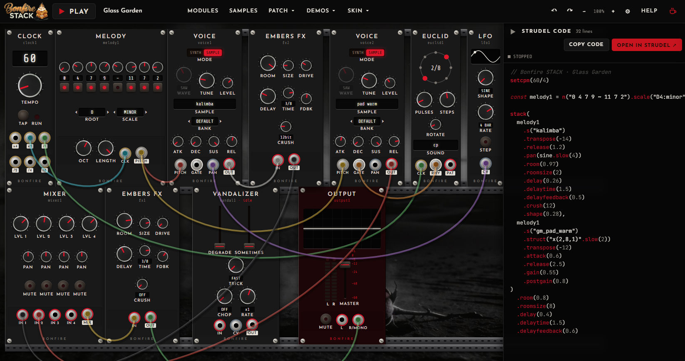

# Bonfire STACK



A browser modular synth rack that writes [Strudel](https://strudel.cc) code. Patch cables between
Eurorack-style modules, turn knobs, and the dock at the bottom shows the Strudel pattern being
played: the exact code. Copy it, or hit **OPEN IN STRUDEL**, and it runs unchanged on strudel.cc.

Named after *máglyarakás*, the Hungarian "bonfire stack" dessert: layers of brioche, apple and
torched meringue, a lot like layers of patterns.

## Run it

```sh
npm install
npm run dev        # http://localhost:5173
npm test           # compiles every demo + module and evaluates the code with the real Strudel transpiler
npm run build      # static site in dist/ — upload anywhere, any sub-path works (base: './')
```

Handy URL switches: `#demo=acid-breakfast` opens a demo, `?skin=midnight` picks a skin,
`?nosplash` skips the welcome dialog.

## How it works

Cables carry **patterns**, not audio: a module chain compiles to a Strudel method chain.

| jack     | carries                                  | becomes                                |
|----------|------------------------------------------|----------------------------------------|
| PATTERN  | sound events                             | `s("bd ~ sd ~").lpf(800)`              |
| PITCH    | notes (also playable on their own)       | `n("0 2 4").scale("C3:minor")`         |
| RHYTHM   | structure only                           | `.struct("x ~ x x*2")`                 |
| CV       | a 0–1 signal                             | `.lpf(sine.slow(4).rangex(400, 3200))` |
| CLOCK    | step length                              | sequencer `.fast()` / `.slow()`        |

- `src/core/compile.js` walks back from OUTPUT and compiles each module once. An output that
  feeds several inputs is hoisted into a `const`. Cycles are refused when you connect.
- `src/core/engine.js` evaluates that same code with Strudel's REPL. Knob moves re-evaluate
  (debounced), and Strudel swaps patterns phase-locked, so nothing drops.
- The sample prebake mirrors strudel.cc's exactly, so every default sound name in the code exists there too.
  User packs become `samples('…')` lines. Local files are flagged in the code as not portable.
- OUTPUT's volume and mute work on the audio output, so they are deliberately **not** in the code.

## Writing a module

Add a definition to `src/modules/` and register it in `src/modules/index.js`:

```js
export const wobble = {
  type: 'wobble',            // id prefix: instances are wobble1, wobble2…
  name: 'WOBBLE', title: 'Wobble Thing', category: 'Shape', hp: 8,
  description: 'Shown in the module browser and the ? help.',
  params: {                  // kind: knob | rotary | fader | switch | toggle | select | sound | data
    depth: { kind: 'knob', label: 'DEPTH', min: 0, max: 1, default: 0.5 },
  },
  inputs: { in: { type: 'pattern', label: 'IN' } },
  outputs: { out: { type: 'pattern', label: 'OUT' } },
  layout: [['depth'], ['in:in', 'out:out']],   // rows; also 'widget:x', 'led:x'
  compile(ctx) {             // ctx.p = params, ctx.in(id) = upstream Expr, ctx.global.bpm
    const e = ctx.in('in');
    return { out: e && e.call('vib', ctx.p.depth) };
  },
};
```

Build code with the helpers in `src/core/expr.js` (`fn`, `mini`, `num`, `.call`, `.callIf`),
never by string concatenation. That keeps the printer's line-wrapping and hoisting working. Run
`npm test` afterwards: it evaluates every module through the real Strudel transpiler.

## Skins

Five ship in `public/skins/`. A skin is a `skin.json` plus images, and every key is optional.
The schema is in [public/skins/README.md](public/skins/README.md). Users can load their own skin from a URL or a file
(SKIN menu).

## Credits & licence

- Sound engine: [Strudel](https://codeberg.org/uzu/strudel) (AGPL-3.0). Samples are streamed from the
  strudel.cc CDN (Dirt-Samples, VCSL (CC0), tidal-drum-machines, Salamander piano (CC-BY), GM soundfonts).
- Artwork generated with Higgsfield for this project.
- Bonfire STACK is free software under the **GNU AGPL-3.0**. See `LICENSE`.
